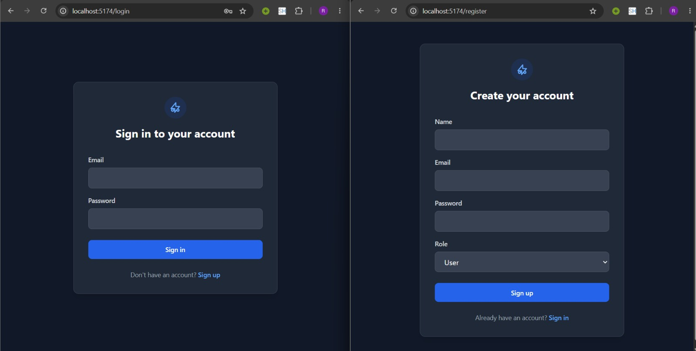

# Car Dealership Inventory System

## Overview
The Car Dealership Inventory System is a full-stack web application designed to help dealership administrators manage their vehicle inventory, while allowing users to browse and purchase vehicles. It solves the problem of tracking stock levels, handling purchases, and managing vehicle details through a clean, responsive interface backed by a secure REST API. 

This project was built as a TDD Kata, focusing on writing clean, testable code and following SOLID principles from the ground up.

## Features

**Authentication**
- User registration and login
- JWT-based authentication
- Role-based authorization (Admin vs. Standard User)

**Vehicle Management**
- Admins can add, update, and delete vehicles
- Users can view available vehicles (quantity > 0)
- Search and filter vehicles by make, model, category, and price range

**Inventory Management**
- Users can purchase vehicles (decrements stock by 1)
- Admins can restock vehicles (increments stock by a specified amount)
- Out-of-stock prevention

**Frontend**
- Responsive Single Page Application (SPA)
- Protected routes based on authentication state
- Admin-specific dashboard
- Dark mode and light mode support

**Testing**
- Backend built using strict Test-Driven Development (TDD)
- Automated API endpoint testing

## Tech Stack

**Backend**
- Node.js
- TypeScript
- Express
- Zod

**Frontend**
- React
- TypeScript
- Vite
- Tailwind CSS
- React Router
- Axios

**Database**
- MongoDB
- Mongoose

**Testing**
- Vitest
- Supertest

**Authentication**
- JSON Web Tokens (JWT)
- bcrypt

## Project Structure

The repository is organized into a frontend and backend directory.

```
car-dealership-inventory/
├── backend/                  # Node.js/Express API
│   ├── src/
│   │   ├── config/           # Database and environment configurations
│   │   ├── controllers/      # HTTP request/response handling
│   │   ├── middleware/       # Authentication and authorization guards
│   │   ├── models/           # Mongoose schemas and interfaces
│   │   ├── routes/           # API route definitions
│   │   ├── services/         # Business logic and database operations
│   │   ├── utils/            # Shared helper functions
│   │   └── validators/       # Zod schemas for request validation
│   └── tests/                # Vitest API tests
└── frontend/                 # React SPA
    ├── src/
    │   ├── assets/           # Static files
    │   ├── components/       # Reusable UI components
    │   ├── context/          # React context (Theme, Auth)
    │   ├── hooks/            # Custom React hooks
    │   ├── layouts/          # Page wrappers and navigation
    │   ├── pages/            # Top-level route components
    │   ├── routes/           # Routing configuration
    │   ├── services/         # Axios API clients
    │   ├── types/            # TypeScript interfaces
    │   └── utils/            # Helper functions
```

## API Endpoints

| Method | Endpoint | Description | Authentication Required |
|--------|----------|-------------|-------------------------|
| POST   | `/api/auth/register` | Register a new user | No |
| POST   | `/api/auth/login` | Login and receive a JWT | No |
| POST   | `/api/vehicles` | Add a new vehicle | Yes (Admin) |
| GET    | `/api/vehicles` | List all available vehicles | Yes |
| GET    | `/api/vehicles/search` | Search vehicles by filters | Yes |
| PUT    | `/api/vehicles/:id` | Update vehicle details | Yes (Admin) |
| DELETE | `/api/vehicles/:id` | Delete a vehicle | Yes (Admin) |
| POST   | `/api/vehicles/:id/purchase` | Purchase a vehicle | Yes |
| POST   | `/api/vehicles/:id/restock` | Restock a vehicle | Yes (Admin) |

## Authentication Flow

Authentication is handled via JSON Web Tokens (JWT). When a user logs in, the backend issues a token that the frontend stores locally. This token is attached to the `Authorization` header as a Bearer token for all subsequent requests.

The frontend uses protected routes to prevent unauthenticated users from accessing the dashboard, and the backend verifies the token before processing requests. Administrative actions (like adding or deleting vehicles) check the user's role in the JWT payload to ensure they have `ADMIN` privileges.

## Frontend

The frontend is a React Single Page Application (SPA) built with Vite. It features:
- **Pages**: Dedicated views for Login, Registration, User Dashboard, and Admin Dashboard.
- **Components**: Reusable UI elements like vehicle cards, forms, and modals.
- **Dark Mode**: Context-based theme toggling supported globally alongside Light Mode.
- **Protected Routes**: Wrappers that redirect unauthenticated users to the login page and restrict standard users from accessing the admin panel.
- **Responsive Design**: Tailwind CSS ensures the application works seamlessly on mobile devices and desktop screens.

## Backend Architecture

The backend follows a layered architecture to separate concerns and adhere to SOLID principles.

`Route` → `Controller` → `Service` → `Database`

1. **Routes** define the API endpoints and attach middleware (like auth and validation).
2. **Controllers** extract data from the HTTP request, pass it to the service, and format the HTTP response.
3. **Services** contain the core business logic (e.g., checking stock before a purchase). They handle database operations and throw errors if business rules are violated.
4. **Models** define the MongoDB schema.

This separation ensures the controllers are thin and only care about HTTP, while the services handle the business logic. This makes the code easier to test and maintain.

## Test-Driven Development

The backend API was developed using a strict Test-Driven Development (TDD) workflow:
1. **Red**: Write a failing test for the endpoint or feature using Vitest.
2. **Green**: Implement the minimum amount of code in the controller and service to make the test pass.
3. **Refactor**: Clean up the implementation, improve naming, extract utilities, and enforce DRY principles while ensuring the tests stay green.

## Running Locally

### Backend
1. Open a terminal and navigate to the backend directory:
   ```bash
   cd backend
   ```
2. Install dependencies:
   ```bash
   npm install
   ```
3. Create a `.env` file (see the Environment Variables section below).
4. Start the development server:
   ```bash
   npm run dev
   ```

### Frontend
1. Open a new terminal and navigate to the frontend directory:
   ```bash
   cd frontend
   ```
2. Install dependencies:
   ```bash
   npm install
   ```
3. Create a `.env` file (see the Environment Variables section below).
4. Start the development server:
   ```bash
   npm run dev
   ```

## Environment Variables

### Backend (`backend/.env`)

| Variable | Purpose | Required |
|----------|---------|----------|
| `PORT` | Port for the backend server | Yes |
| `MONGO_URI` | MongoDB connection string | Yes |
| `JWT_SECRET` | Secret key for signing JWT tokens | Yes |

### Frontend (`frontend/.env`)

| Variable | Purpose | Required |
|----------|---------|----------|
| `VITE_API_URL` | The base URL for the backend API | Yes |

## Screenshots

### Login


### User Dashboard


### Admin Panel


## Test Report

Tests are located in the `backend/tests` directory. To run the test suite:

```bash
cd backend
npm run test
```

The expected output will show all test suites (Authentication, Vehicle Management, Inventory) passing, confirming that all endpoints behave as expected under both successful conditions and edge cases.

## My AI Usage

As part of the assignment requirements, I utilized AI tools during the development process to assist with planning and boilerplate generation. 

**ChatGPT**
I used ChatGPT primarily as a sounding board before writing code. I would read the feature requirements, form my own implementation plan, and then discuss it with ChatGPT. 
Examples of how I used it:
- Discussing the architectural split between controllers and services.
- Reviewing schema design and field types for the database.
- Brainstorming edge cases for inventory validation.
- Talking through testing scenarios to ensure I had adequate coverage before starting the RED phase.
- Bouncing off refactoring ideas to ensure I was adhering to SOLID principles.

**GitHub Copilot**
I used GitHub Copilot during the actual coding phases to speed up implementation.
Examples of how I used it:
- Generating boilerplate code for new routes and controllers.
- Autocompleting repetitive TypeScript interfaces and Zod validation schemas.
- Scaffolding the initial structure of service methods based on the tests I had just written.

Every generated code suggestion was reviewed, modified when necessary, tested, and validated manually.

## Future Improvements

- **Pagination**: Implement pagination on the vehicle listing and search endpoints to handle larger inventories efficiently.
- **Docker**: Containerize the application using Docker to simplify the setup process for new developers.
- **Deployment**: Set up a CI/CD pipeline and deploy the application to a cloud provider.

## License

MIT